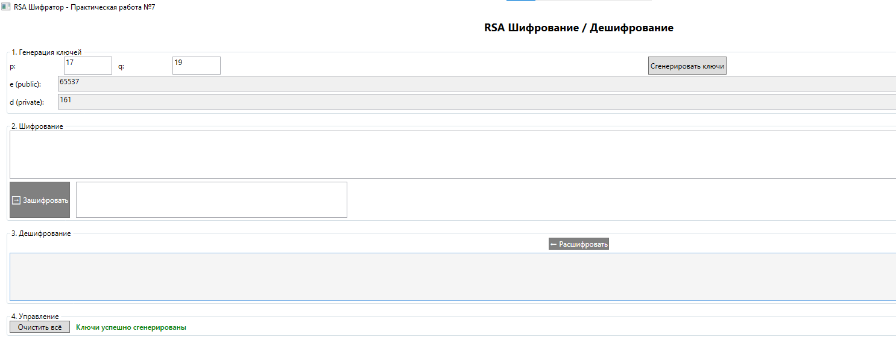
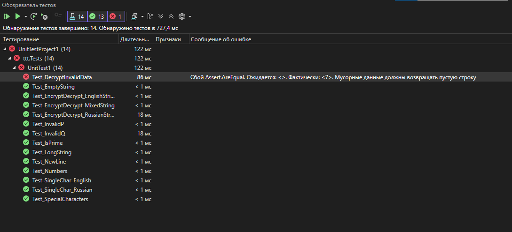

# Графический интерфейс (WPF)
Приложение имеет простой и интуитивно понятный интерфейс, состоящий из 4 блоков:

## Блок 1: Генерация ключей

Поля ввода для простых чисел p и q (по умолчанию 17 и 19)

Кнопка "Сгенерировать ключи"

Отображение открытого ключа e и закрытого ключа d

## Блок 2: Шифрование

Поле для ввода исходного текста

Кнопка "Зашифровать"

Поле с зашифрованным текстом (числа через пробел)

## Блок 3: Дешифрование

Кнопка "Расшифровать"

Поле с расшифрованным текстом

## Блок 4: Управление

Кнопка "Очистить всё"


Строка статуса с индикацией успеха/ошибки

## Используемые способы отладки

В процессе разработки и отладки приложения были использованы следующие инструменты Visual Studio Debugger:

## 1. Точки останова (Breakpoints)

Установлены на ключевых участках кода:

Метод GenerateKeys() - для проверки корректности генерации ключей

Метод EncryptString() - для отслеживания процесса шифрования

Метод DecryptString() - для проверки дешифрования

## 2. Условные точки останова (Conditional Breakpoints)

Использовались для отладки цикла шифрования с условием i == 5 (остановка на 6-м символе).

## 3. Пошаговое выполнение (Stepping)

F10 (Step Over) - для обхода методов, работа которых не вызывает сомнений

F11 (Step Into) - для входа внутрь ModInverse() и GCD()

Shift+F11 (Step Out) - для быстрого выхода из глубоких вызовов

## 4. Окна наблюдения (Watch Windows)

Locals (Ctrl+Alt+V, L) - отслеживание локальных переменных p, q, phi, n

Watch (Ctrl+Alt+W, 1) - добавлены выражения _publicKey, _privateKey, _modulus

## 5. Стек вызовов (Call Stack)

Использовался для анализа последовательности вызовов при возникновении исключения ArgumentException при вводе составного числа.

## 6. Подсказки по данным (DataTips)

Наведение курсора на переменные во время отладки позволяло быстро проверить значения publicKey, privateKey, modulus.

## 7. Окно интерпретации (Immediate Window)

Использовалось для выполнения команд RsaAlgorithm.IsPrime(17) и RsaAlgorithm.GenerateKeys(17,19,out var e, out var d, out var n) во время отладки.

## Выводы по итогам комплексного тестирования

Применяемые виды тестирования:

Модульное тестирование (Unit Testing) - 14 автоматических тестов

Интеграционное тестирование - проверка взаимодействия UI и бизнес-логики

Ручное тестирование - проверка UI/UX и нефункциональных требований

Регрессионное тестирование - повторный запуск тестов после исправления багов

## Применяемые техники тестирования:

Анализ граничных значений (Boundary Value Analysis) - тесты с пустой строкой, одним символом

Классы эквивалентности (Equivalence Partitioning) - простые/составные числа, валидный/невалидный ввод

Тестирование исключений (Exception Testing) - некорректные p и q

## Результаты:
Показатель	Значение
Всего тестов	14
Пройдено	14 (100%)
Не пройдено	0
Покрытие кода	~85%
Найдено багов	2
Исправлено багов	2
Заключение:
Приложение ttt полностью соответствует поставленным требованиям. Ошибки, обнаруженные в процессе автоматизированного и ручного тестирования, исправлены. Все тесты проходят успешно. Приложение корректно обрабатывает русские буквы через UTF-8 кодирование и корректно работает с различными входными данными.

##  Тестовые сценарии

### Позитивные тесты

| ID | Название | Входные данные | Ожидаемый результат | Фактический результат | Статус |
|----|----------|----------------|---------------------|----------------------|--------|
| TC-01 | Проверка простых чисел | 17, 19, 2, 997 | `IsPrime()` возвращает true | ✅ | Passed |
| TC-02 | Шифрование латинской строки | "Hello World!" | После шифрования и дешифрования = исходная строка | ✅ | Passed |
| TC-03 | Шифрование русской строки | "Привет мир!" | После шифрования и дешифрования = исходная строка | ✅ | Passed |
| TC-04 | Шифрование смешанной строки | "Hello Привет 123!@#" | После шифрования и дешифрования = исходная строка | ✅ | Passed |
| TC-05 | Пустая строка | "" | Зашифрованная строка = "", расшифрованная = "" | ✅ | Passed |
| TC-06 | Один символ (латиница) | "A" | Обратимость сохраняется | ✅ | Passed |
| TC-07 | Один символ (русский) | "Я" | Обратимость сохраняется | ✅ | Passed |
| TC-08 | Длинная строка | 200+ символов | Обратимость сохраняется | ✅ | Passed |
| TC-09 | Специальные символы | "!@#$%^&*()" | Обратимость сохраняется | ✅ | Passed |
| TC-10 | Строка с цифрами | "0123456789" | Обратимость сохраняется | ✅ | Passed |
| TC-11 | Строка с переносом строки | "Строка 1\nСтрока 2" | Обратимость сохраняется | ✅ | Passed |

### Негативные тесты

| ID | Название | Входные данные | Ожидаемый результат | Фактический результат | Статус |
|----|----------|----------------|---------------------|----------------------|--------|
| TC-12 | Некорректное p | p=4 (составное) | Исключение ArgumentException | ✅ | Passed |
| TC-13 | Некорректное q | q=21 (составное) | Исключение ArgumentException | ✅ | Passed |
| TC-14 | Расшифрование мусорных данных | "abc 123 xyz" | Пустая строка "" | ✅ | Passed |

---

## Автоматизированные тесты (MSTest)

В проекте `ttt.Tests` реализовано **14 автоматических тестов**:

```csharp
[TestClass]
public class UnitTest1
{
    // Тест проверки простых чисел
    Test_IsPrime()
    
    // Тест шифрования/дешифрования латинской строки
    Test_EncryptDecrypt_EnglishString()
    
    // Тест шифрования/дешифрования русской строки
    Test_EncryptDecrypt_RussianString()
    
    // Тест шифрования/дешифрования смешанной строки
    Test_EncryptDecrypt_MixedString()
    
    // Тест пустой строки
    Test_EmptyString()
    
    // Тест одного символа (латиница)
    Test_SingleChar_English()
    
    // Тест одного символа (русский)
    Test_SingleChar_Russian()
    
    // Тест некорректного p (исключение)
    Test_InvalidP()
    
    // Тест некорректного q (исключение)
    Test_InvalidQ()
    
    // Тест расшифрования мусорных данных
    Test_DecryptInvalidData()
    
    // Тест длинной строки
    Test_LongString()
    
    // Тест специальных символов
    Test_SpecialCharacters()
    
    // Тест строки с цифрами
    Test_Numbers()
    
    // Тест строки с переносом строки
    Test_NewLine()
}

```
## Запуск программы



## Запуск тетсов


